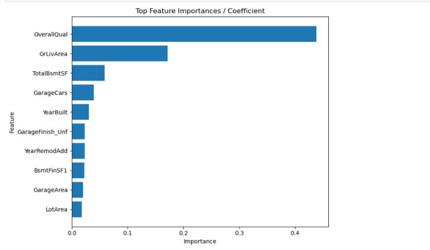

#  House Price Prediction & Analysis  

---

## Project Overview

---

This project focuses on predicting house prices using machine learning techniques. The analysis is presented in a Jupyter notebook located Files/House_price_prediction.ipynb, which demonstrates end-to-end steps of data cleaning, feature engineering, model training, evaluation, and interpretation of results. 

The goal is to identify the most significant factors that influence house prices and build a reliable predictive model.

In addition, a presentation file is included at:
Files/house_price_prediction.pptx
This PowerPoint file contains a full analysis and insights related to the project

---

##  Repository Structure
```bash
   House_Price_Prediction/
   │── Files/
   │   ├── House_price_prediction.ipynb
   │   ├── house_price_prediction_insight.pptx
   │
   │── images/
   │   ├── feature_imp
   │   
   │── project_files/
   │   ├── train.csv
   │   ├── test.csv
   │
   │── requirements.txt
   │── README.md
   │── LICENSE
   │── .gitignore
   │── .gitattributes

 ```
---


##  Setup & Installation

1. **Clone the repository**
   ```bash
   git clone https://github.com/<kanyi-Gabriel>/House_Price_Prediction.git
   cd House_Price_Prediction
   
2. Create a virtual environment
    ```bash

   conda create -- name environment_name
   conda activate environment_name
   pip install -r requirements.txt
    
3. To add the environment to jupyter notebook
    ```bash
    conda install -c anaconda ipykernel
    python -m ipykernel install --user--name = environment_name


---
## Key Insights

Overall Quality is the single strongest predictor of house price.

Size-related features (living area, basement, garage) strongly influence prices.

Recently built or remodeled houses command higher prices.

Engineered features like TotalSF and House_Age improved predictive power.



